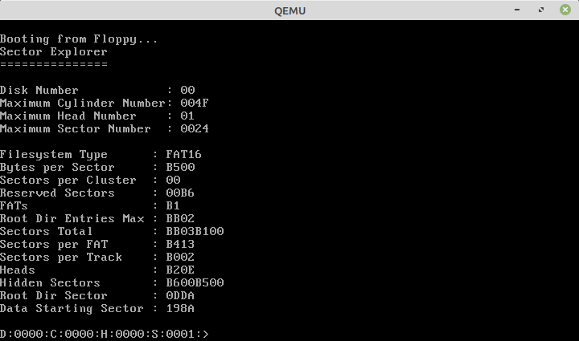

DiskSectorExplorer
==================

The assembly language code in this repository uses BIOS interrupts and a simple command prompt interface to allow the user to navigate through the sectors of a disk and view or edit the bytes stored on them.

Building and Running
--------------------

Included in this repository are some small scripts that compile the program in FASM and run it in QEMU.

Linux
-----
1. Install FASM and QEMU, perhaps by running "sudo apt fasm" and "sudo apt qemu".
2. Run the script "Qemu-CreateDiskImage.sh".  A disk image file of 1 MB will be created.
3. Run the script "BuildInFasmAndRunInQemu.sh".  The .asm file will be compiled and the program will be started in an instance of QEMU.

Microsoft Windows
-----------------
1. Download and install FASM and QEMU.
2. Plug in a USB stick and make a note of the drive letter it's assigned to.  (Note that there's probably a way to run it against a fake disk image, too.)
3. Open the script "BuildInFasmAndRunInQemu.bat, change the "G:" to the drive letter noted in the previous step, and save.
4. Run the script.
